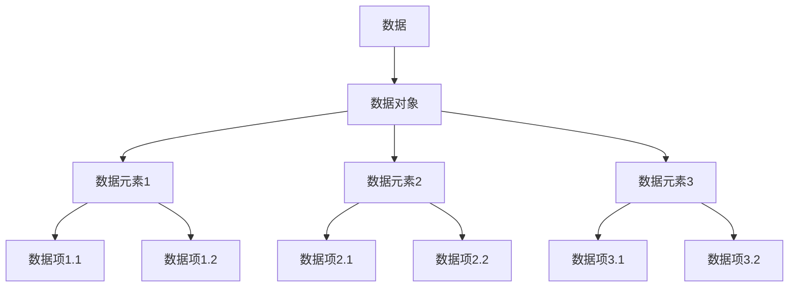
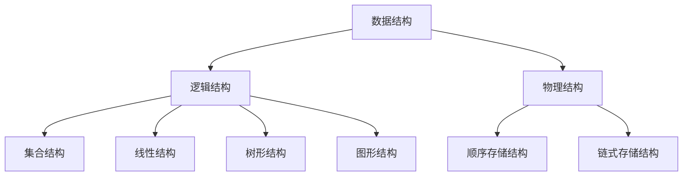
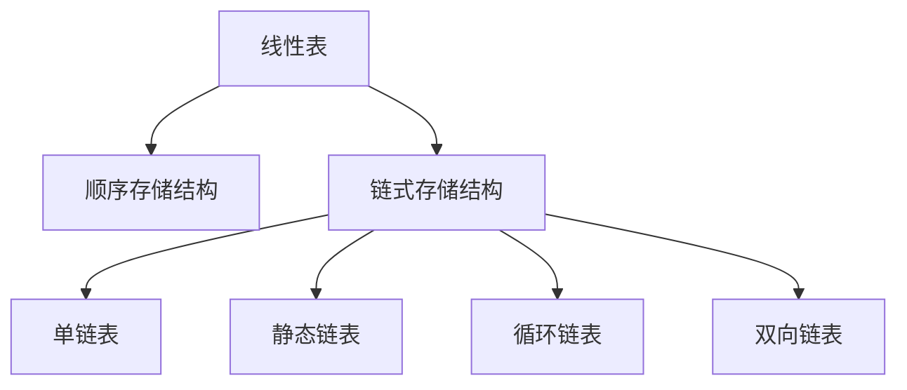

# 1. 绪论

> 启示
>
> 数据结构是相互之间存在一种或多种特定关系的数据元素的集合。

## 1.1 逻辑结构与物理结构

1. 按照视点不同，把数据结构分为逻辑结构和物理结构
2. 逻辑结构（抽象视点）
   1. 关注点：数据元素之间的逻辑关系
   2. 面向问题，在理解问题后选择一个合适的数据结构来表示数据元素之间的逻辑关系
3. 物理结构（实现视点）
   1. 关注点：数据在计算机中的实际存储方式
   2. 面向计算机，其基本目标就是将数据及其逻辑关系存储到计算机的内存中

## 1.2 抽象数据类型

```
ADT 抽象数据类型名
Data
  数据元素之间逻辑关系的定义
Operation
  操作 1
    初始条件
    操作结果描述
  操作 2
    ...
  操作 n
    ...
endADT
```

在数据类型一节中，作者提到高级语言开发不关心计算机的内部原理，不关心 CPU 为了实现 1+2 进行了几次开关操作，我想这是对的。我需要了解自己作为程序员，尤其现在仅仅是一位 Java 的业务程序员，应该把知识边界划在哪里，以便更有效地提升自己，为当前或下一份工作做准备。

```text
    作为业务开发程序员，你的知识边界应当围绕"有效提升业务交付能力"和"职业发展竞争力"两个维度展开。以下是具体建议的分层知识框架：
第一层：业务开发核心能力
1. 领域建模能力
- 掌握DDD四层模型（失血/贫血/充血/胀血模型）
- 事件风暴工作坊实践
- 统一语言构建技巧
- 聚合根设计原则（如订单与订单项的强一致性维护）
2. 框架深度认知
- Spring框架的核心机制（Bean生命周期、AOP实现原理、事务传播机制）
- ORM框架的N+1问题优化（Hibernate的Fetch策略、MyBatis的ResultMap高级用法）
- 分布式事务解决方案（Saga模式、Seata的AT/TCC模式选择）
第二层：架构设计能力
3. 微服务架构实践
- 服务粒度划分的康威定律应用
- API网关的熔断降级策略（Hystrix线程池隔离 vs Sentinel信号量隔离）
- 服务网格的数据平面与控制平面（Istio的Envoy代理配置）
4. 云原生技术栈
- Kubernetes的Pod调度策略（亲和性/反亲和性配置）
- 服务网格的mTLS实现（Istio的Citadel组件）
- Serverless的冷启动优化（AWS Lambda的Provisioned Concurrency）
第三层：深度优化能力
5. JVM调优实战
- G1收集器的Region分配策略
- ZGC的染色指针技术原理
- 内存泄漏定位（MAT的Dominator Tree分析）
6. 数据库高阶应用
- MySQL的索引合并优化（Index Merge）
- 分布式ID生成方案（Leaf的号段模式 vs Snowflake算法）
- 读写分离下的数据一致性保障（GTID同步机制）
第四层：工程效能提升
7. 持续交付体系
- 流水线设计（蓝绿部署和金丝雀发布的自动化实现）
- 混沌工程实践（ChaosBlade的故障注入场景设计）
- 监控体系构建（Metrics/Tracing/Logging的三位一体）
学习策略建议
- 技术雷达扫描：每季度用ThoughtWorks技术雷达评估技术趋势
- 深度/广度平衡：遵循T型人才发展模型，在业务领域纵深发展（如电商的库存一致性方案），在通用技术横向扩展
- 认知负荷管理：使用Anki进行间隔重复记忆，对设计模式等知识进行长期记忆固化
避坑指南
- 避免过早深入编译器原理（如JIT的C1/C2编译器实现）
- 不必过度研究CPU流水线冒险处理
- 暂不需掌握物理层的信号调制技术
职业发展的关键在于建立"业务洞察→技术实现→价值交付"的闭环能力。建议每完成一个项目后，用ARCA模型（Awareness/Reflection/Conceptualization/Application）进行经验提炼，逐步构建自己的技术体系。
```

## 1.3 总结





# 2. 算法

> 启示
>
> 算法是解决特定问题求解步骤的描述，在计算机中表现为指令的有限序列，并且每条指令标识一个或多个操作。

# 3. 线性表

> 启示
>
> 线性表是零个或多个数据元素的有限序列。

## 3.1 线性表的抽象数据类型

```
ADT 线性表（List）
Data
  线性表的数据对象集合为{a1, a2, ..., an}，每个元素的类型均为 DataType。其中，除第一个元素 a1 外，每一个元素有且只有一个直接前驱元素，除了最后一个元素 an 外，每一个元素有且只有一个直接后继元素。数据元素之间的关系是一对一的关系。
Operation
  InitList(*L): 初始化操作，建立一个空的线性表 L。
  ListEmpty(L): 若线性表为空则返回 true，否则返回 false。
  ClearList(*L): 将线性表清空。
  GetElem(L, i, *e): 将线性表 L 中的第 i 个元素值返回给 e。
  LocateElem(L, e): 在线性表 L 中查找与给定值 e 相等的元素，如果查找成功，返回该元素在表中序号表示成功；否则，返回 0 表示失败。
  ListInsert(*L, i, e): 在线性表 L 的第 i 个位置插入一个值为 e 的新元素。
  ListDelete(*L, i, *e): 在线性表 L 的第 i 个位置删除一个元素，并返回该元素的值给 e。
  ListLength(L): 返回线性表 L 的元素个数。
endADT
```

## 3.2 线性表的顺序存储结构

线性表的顺序存储结构，指的是用一段地址连续的存储单元依次存储线性表的数据元素。
存取时间性能为 O(1)，通常我们把具有这一特点的存储结构称为随机存取结构。

```text
理解：
线性表的顺序存储结构及其O(1)存取时间性能可以这样理解：
1. 连续存储与地址计算
顺序存储结构（如数组）在内存中使用连续的地址块存放元素。每个元素的地址可通过基地址和偏移量直接计算：
元素地址=基地址+(i−1)×元素大小
例如，若基地址为1000，每个元素占4字节，则第3个元素的地址为1000 + 2×4 = 1008。这种计算是一次操作，与元素数量无关。

2. 随机存取的含义
随机存取（Random Access） 指无需遍历即可直接访问任意位置元素。例如，访问数组的第5个元素只需计算地址并读取，耗时恒定；而链表必须从头节点逐个遍历到目标位置，时间随位置线性增长（O(n)）。

3. O(1)的时间复杂度
  - 存取操作：顺序结构通过地址计算直接定位元素，仅需一次内存访问，时间复杂度为O(1)。
  - 对比链式结构：链表需从头部逐步移动指针，平均时间复杂度为O(n)，属于顺序存取（Sequential Access）。

4. 操作效率的权衡
  - 优势：快速访问、修改元素（O(1)）。
  - 劣势：插入/删除需移动后续元素（O(n)）。
  - 适用场景：频繁访问但较少修改的场景（如静态数据查询）。

总结
顺序存储结构通过连续内存布局和直接地址计算实现随机存取，使得访问任意元素的时间恒定为O(1)。这种特性使其成为处理快速查询任务的理想选择，但需权衡插入/删除操作的效率。
```

## 3.3 顺序存储结构的优缺点

- 优点
  - 无需为表示元素之间的逻辑关系而增加额外的存储空间
    > 顺序存储结构利用内存的连续性和下标，隐式地表示了元素的逻辑顺序，无需像链式存储那样显式存储指针或关联字段，从而节省了这部分空间
  - 可以快速地存取表中任一位置的元素
- 缺点
  - 插入和删除操作的效率低，需要移动大量元素
  - 当线性表长度变化较大时，难以确定存储空间的容量
  - 造成存储空间的“碎片”

## 3.4 线性表的链式存储结构

### 头指针和头结点的异同

在线性表的链式存储结构中，头指针和头节点是两个既有联系又有区别的重要概念，它们的关系如下：

#### **1. 基本定义**

- **头指针（Head Pointer）**  
  是指向链表**第一个节点**的指针（或引用）。它是链表的入口，通过头指针可以访问整个链表。
  - 在不带头节点的链表中，头指针直接指向第一个**数据节点**（即存储实际数据的节点）。
  - 在带头节点的链表中，头指针指向**头节点**（一个不存储实际数据的特殊节点）。
- **头节点（Head Node）**  
  是链表中**人为添加的第一个节点**，通常不存储数据（或存储链表长度等附加信息），其唯一作用是简化链表操作（如插入、删除）。
  - 头节点的 `next` 指针指向第一个**数据节点**。
  - 头节点是可选的，根据实际需求决定是否使用。

#### **2. 两者的关系**

##### **情况一：链表** **不带头节点**

- **头指针直接指向第一个数据节点**。
- 若链表为空，头指针为 `NULL`（或 `None`）。
- **无额外的头节点**，结构更简单，但插入/删除第一个节点时需特殊处理头指针。

##### **情况二：链表** **带头节点**

- **头指针指向头节点**，头节点的 `next` 指向第一个数据节点。
- 即使链表为空，头指针也不为 `NULL`（始终指向头节点），头节点的 `next` 为 `NULL`。
- **头节点是头指针的目标节点**，是链表操作的“基准点”，可统一处理所有节点（包括第一个数据节点）的插入/删除逻辑。

#### **3. 对比与应用场景**

| **特性**            | **不带头节点的链表**        | **带头节点的链表**                              |
| ------------------- | --------------------------- | ----------------------------------------------- |
| 头指针指向          | 第一个数据节点（或 `NULL`） | 头节点（非数据节点，`next` 指向第一个数据节点） |
| 空链表条件          | 头指针为 `NULL`             | 头节点的 `next` 为 `NULL`                       |
| 插入/删除首节点操作 | 需单独处理头指针的修改      | 与其他节点操作一致（只需修改头节点的 `next`）   |
| 代码复杂度          | 较低（无额外节点）          | 稍高（需维护头节点）                            |
| 适用场景            | 简单场景，追求内存效率      | 复杂操作（如频繁插入/删除），代码逻辑统一       |

#### **4. 图示说明**

##### **不带头节点的链表**

```
空链表：头指针 = NULL
非空链表：头指针 → 数据节点1 → 数据节点2 → ... → 数据节点n
```

##### **带头节点的链表**

```
空链表：头指针 → 头节点（next=NULL）
非空链表：头指针 → 头节点（next→数据节点1 → 数据节点2 → ... → 数据节点n）
```

#### **总结**

- **头指针是链表的“入口”**，其指向决定了链表的起始位置。
- **头节点是头指针的“目标节点”**（仅在带头节点的链表中存在），用于简化操作逻辑，避免特殊处理首节点。
- 两者关系的核心区别在于链表是否包含额外的头节点：头指针直接指向第一个数据节点（无节点）或头节点（有节点）。  
  实际编程中，带头节点的链表更常用，因为它能统一操作逻辑，减少边界条件的处理，提高代码的鲁棒性。

## 3.5 单链表结构与顺序存储结构对比

- 存储分配方式
  - 顺序存储结构用一段连续的存储单元依次存储线性表元素，每个存储单元存储一个元素
  - 单链表采用链式存储结构，用一个存储单元存储一个元素，用一个存储单元存储下一个元素的地址，实现链式存储结构
- 时间性能
  - 查找
    - 顺序存储结构：O(1)
    - 单链表：O(n)
  - 插入/删除
    - 顺序存储结构需要平均移动表一半的元素，时间为 O(n)
    - 单链表在先找出某位置的指针后，插入和删除操作时间仅为 O(1)
- 空间性能
  - 顺序存储结构需要预分配存储空间，分大了浪费，分小了易发生上溢
  - 单链表不需要分配存储空间，只要有就可以分配，元素个数不受限制

## 3.6 静态链表结构（static linked list）

用数组描述的链表叫做静态链表

- 优点
  - 插入和删除只需要修改游标，不需要移动元素
- 缺点
  - 没有解决连续存储分配带来的表长难以确定的问题
  - 失去了顺序存储结构的随机存储特性

## 3.7 循环列表（circular linked list）

## 3.8 双向链表（double linked list）

## 3.9 总结



# 4. 栈与队列

> 启示
>
> 栈是限定仅在表尾进行插入和删除操作的线性表。队列是只允许在一端进行插入操作、而在另一端进行删除操作的线性表。

## 4.1 栈

栈（stack）是限定仅在表尾进行插入和删除操作的线性表。

允许插入和删除的一端称为栈顶（top），另一端称为栈底（bottom），不含任何数据元素的栈称为空栈。栈又称为后进先出（Last In First Out）的线性表，简称 LIFO 结构。

理解栈首先要明白它是一个线性表，栈元素具有线性关系，即前驱后继关系。只不过是一种特殊的线性表。定义中说是在线性表的表尾进行插入和删除操作，这里表尾就是指栈顶，不是栈底。它的特殊之处就在于限制了这个线性表的插入和删除位置。

> 栈的应用
>
> - 浏览器的后退功能，编辑软件的 undo（撤销）操作等等。
> - 在程序设计语言中实现了递归。
> - 后缀（逆波兰）表示法定义的四则运算表达式求值。

栈的插入操作：进栈、压栈、入栈。

栈的删除操作：出栈、弹栈。

## 4.2 栈的抽象数据类型

```
ADT 栈（stack）
Data
  同线性表。元素具有相同的类型，相邻元素具有前驱和后继关系。
Opertation
  InitStack(*S)：初始化操作，建立一个空栈 S。
  DestroyStack(*S)：若栈存在，则销毁它。
  ClearStack(*S)：将栈清空。
  StackEmpty(S)：若栈为空，则返回 true，否则返回 false。
  GetTop(S, *e): 若栈存在且非空，用 e 返回 S 的栈顶元素。
  Push(*S, e): 若栈 S 存在，插入新元素 e 到栈 S 中并成为栈顶元素。
  Pop(*S, *e): 删除栈 S 的栈顶元素，并用 e 返回其值。
  StackLength(S): 返回栈 S 的元素个数。
endADT
```

## 4.3 栈的顺序存储结构及实现

简称为顺序栈。

下标为 0 的一端作为栈底比较好，因为首元素都存在栈底，变化最小，所以让它作栈底。定义 top 来指示栈顶元素在数组中的位置，top 必须小于存储栈的长度。当栈存在一个元素时，top 等于 0，因此通常把空栈的判定条件定为 top 等于 -1。

栈的进栈、出栈操作不涉及任何循环语句，因此时间复杂度均为 O(1)。

## 4.4 两栈共享空间

使用同一个数组实现两个栈，一个栈的栈底为数组的起始位置 0，另一个栈的栈底为数组的末尾位置 n-1 处。

栈空：栈 1 为空时，top1 = -1，栈 2 为空时，top2 = n。

栈满：当两个栈的栈顶指针相遇时栈满，也就是两个指针之间相差 1 时（如极端情况：当栈 1 为空 top1=-1，栈 2 满 top2=n；当栈 1 为满 top1=n-1，栈 2 为空 top2=n），即 top1 + 1 == top2。

## 4.5 栈的链式存储结构及实现

简称为链栈。

由于单链表有头指针，而栈顶指针也是必须的，所以直接合二为一，将栈顶放在单链表的头部。另外，都已经有栈顶的在头部了，单链表中比较常用的头结点也就失去了意义，通常对于链栈来说，是不需要头结点的。

栈空：top = NULL;

栈满：通常不会栈满。

栈的进栈、出栈操作不涉及任何循环语句，因此时间复杂度均为 O(1)。

## 4.6 栈的应用——四则运算表达式求值

### 4.6.1 后缀（逆波兰）表示法定义

一种不需要括号的后缀表达法，我们也把它称为逆波兰（Reverse Polish Notation，RPN）表达式。之所以叫后缀，是因为所有的运算符都放在操作数之后。

> 如：9 3 1 - 3 \* + 10 2 / +

### 4.6.2 后缀表达式计算结果

计算规则：从左到右遍历表达式的每个数字和符号，遇到数字则进栈，遇到运算符则将处于栈顶的两个数字出栈，进行运算，运算结果进栈，直到表达式结束。

### 4.6.3 中缀表达式转后缀表达式

平常的标准四则运算表达式是一种中缀表达式

> 如：9 + (3 - 1) \* 3 + 10 / 2

转换规则：从左到右遍历中缀表达式的每个数字和符号，若是数字就输出，即成为后缀表达式的一部分；若是符号，先看是不是右括号，如果是则输出栈顶元素直到匹配的左括号，若不是，则判断其与栈顶符号的优先级，若优先级不高于栈顶符号则栈顶元素依次出栈并输出，并将当前符号进栈，一直到最终输出后缀表达式为止。

## 4.7 队列

队列（queue）是只允许在一端进行插入操作，在另一端进行删除操作的线性表。

队列是一种先进先出（First In First Out）的线性表，简称 FIFO。允许插入的一端为队尾，允许删除的一端为队头。

> 队列的应用
>
> - 电脑操作系统中多个程序需要通过一个通道输出，按先后次序排队等待的现象。
> - 客服排队。
> - 键盘输入，再到显示器如记事本软件的输出。

## 4.8 队列的抽象数据类型

```
ADT 队列（Queue）
Data
  同线性表。元素具有相同的类型，相邻元素具有前驱和后继关系。
Operation
  InitQueue(*Q)：初始化操作，建立一个空队列 Q。
  DestroyQueue(*Q)：若队列 Q 存在，则销毁它。
  ClearQueue(*Q)：若队列 Q 存在，则将 Q 重置为空队列。
  QueueEmpty(Q)：若队列 Q 为空，则返回真，否则返回假。
  GetHead(Q, *e)：若队列 Q 存在且非空，用 e 返回队列 Q 的对头元素。
  EnQueue(Q, e)：若队列 Q 存在，且队列未满，则插入元素 e 到队列 Q 的队尾。
  DeQueue(Q, *e)：若队列 Q 存在且非空，则删除队列 Q 的对头元素，并用 e 返回其值。
  QueueLength(Q)：返回队列 Q 的元素个数。
```

## 4.9 循环队列

### 4.9.1 队列顺序存储的不足

如果使用数组实现，下标为 0 的一端设为队头，数组最后一个元素的位置设为队尾，那么当入队时，时间复杂度为 O(1)，但出队时，时间复杂度为 O(n)，即需要将整个队列中的元素都向前移动一位。

为了改进这一点，不再将下标为 0 的位置设置为队头，而是引入两个指针来标记队头队尾。front 指针指向队头元素，rear 指针指向队尾元素的下一个位置（当 front 等于 rear 时，此队列为空队列），这样入队和出队操作的时间复杂度都为 O(1)。

### 4.9.2 循环队列的定义

我们把队列的这种头尾相接的顺序存储结构称为循环队列。

队空：front == rear

队满：(rear + 1) % QueueSize == front（剩余一个元素空间即认为已经队满了，取模的目的是为了整合 rear 和 front 大小的问题）

通用计算队列长度公式：(rear - front + QueueSize) % QueueSize

## 4.10 队列的链式存储结构

队列的链式存储结构，其实就是线性表的单链表，只不过它只能尾进头出而已，简称链队列。
